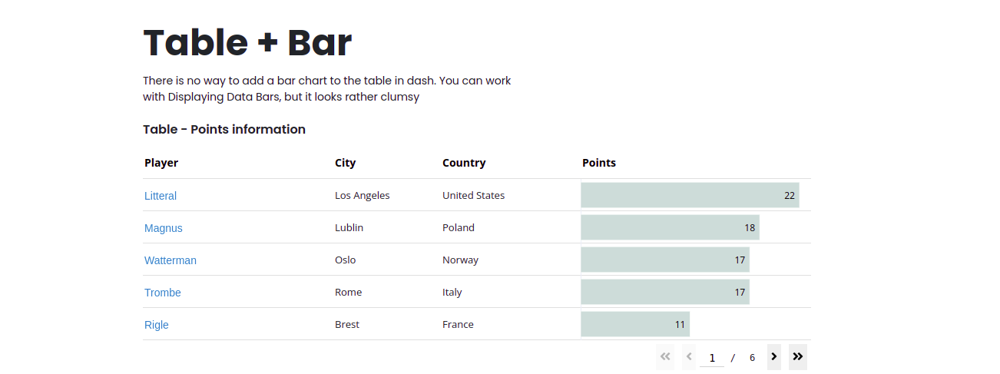

# The symbiosis table with barchart using Dash (Plotly)
There is no way to add a bar chart to the table in dash.
We can use of background linear-gradient colors to display horizontal bar charts within the table.

But in this example, I glued the table and the barchart.
In the future, I plan to add adaptation for mobile devices with rebuilding from a horizontal barchart to a vertical one

